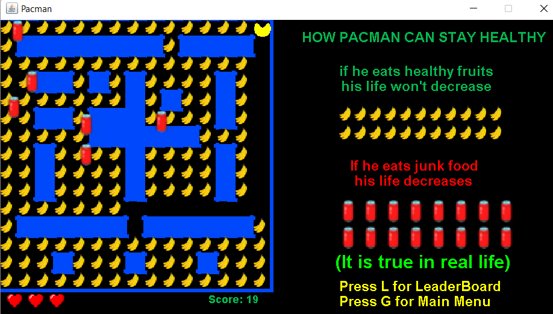
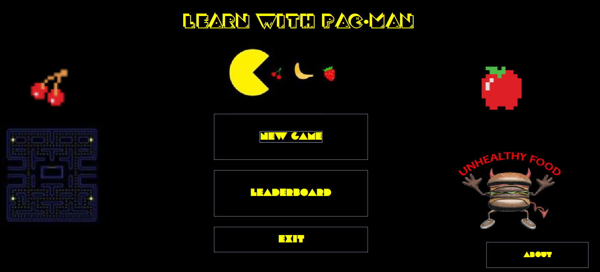

# LEARN-WITH-PACMAN
## Mail to : [suriyaa2002@gmail.com](mailto:suriyaa2002@gmail.com) for access to Full Project Report and Full Project Code.

"Learn with Pac-Man" is an action maze chase video game; the player controls the eponymous Pac-Man character through an enclosed maze. 
The objective of the game is to eat all of the HEALTHY FRUITS placed in the maze while avoiding JUNK FOODS — Cola, Pizza, Burger — that pursue Pac-Man. When Pac-Man eats all of the fruits, the player wins the level. 
Levels can be chosen from the Menu screen. 
Modern Render to this Classic game

Each level provides 3 lives for Pac-Man. If Pac-Man is caught by a Junk Food, he will lose a life; the game ends when all lives are lost. 

## Thank You!
Please ⭐️ this repo and share it with others

### Screenshots
Game Board |  Home Page
:------------------:|:-------------------
 |  

### Requirements 🔧
* Java version 8 or higher.
* ojdbc8.jar
* OracleXE 10g

### Installation 🔌
1. Press the **Fork** button (top right the page) to save copy of this project on your account.

2. Download the repository files (project) from the download section or clone this project by typing in the bash the following command:

       git clone https://github.com/SuriyaaVijay/LEARN-WITH-PACMAN-JAVA.git
3. Imported it in Intellij IDEA or any other Java IDE.
4. Configure Oracle Database username, password and version.
5. Create a table [create table Leaderboard (Sno int(5), Score int(4), Data varchar(25))];
6. Run the application :D

### Maze Design
Numbers make up the maze. Number 1 is a left corner. Numbers 2, 4 and 8 represent top, right, and bottom corners respectively. Number 16 is a point. These numbers can be added, for example number 19 in the upper left corner means that the square will have top and left borders and a point (16 + 2 + 1).

### Contributing 💡
If you want to contribute to this project and make it better with new ideas, your pull request is very welcomed.
If you find any issue just put it in the repository issue section, thank you.
